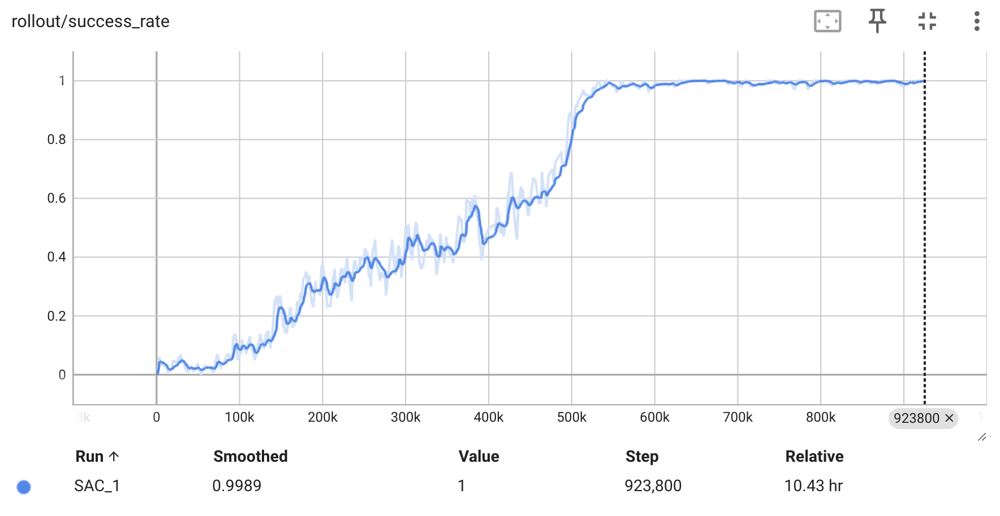

# Journey to Mastering Reinforcement Learning

<p align="center">
  
  <br>
  <em>Trained SAC+HER agent performing pick and place task in FetchPickAndPlace-v4 environment</em>
</p>


## Overview

Goal: Intensive 3-day journey from foundational Reinforcement Learning (RL) concepts to successfully training and evaluating a robotic manipulation agent for pick and place task.


## Key Achievements

- Learnt about the fundamentals of RL concepts ([learning notes here](./learning_notes.md)).
- Trained a SAC+HER (Soft Actor-Critic with Hindsight Experience Replay) agent using Stable Baselines3 and Gymnasium.
- Achieved a **100% success rate** in the FetchPickAndPlace-v4 environment.
    <p align="center">
        
    </p>


## Technical Implementation
- **Framework**: [Stable Baselines3](https://stable-baselines3.readthedocs.io/en/master/) + [Gymnasium](https://gymnasium.farama.org/)
- **Algorithm**: SAC (Soft Actor-Critic) with HER (Hindsight Experience Replay)
- **Environment**: FetchPickAndPlace-v4 from [Gymnasium-Robotics](https://robotics.farama.org/index.html) (powered by MuJoCo)
- **Python Version**: 3.12.3
- **Hardware**: macOS Sequoia 15.2 (CPU training on M1 Pro)


## Quick Start Guide

### Setup

```bash
# Clone repository
git clone https://github.com/weijieyong/Mastering-RL.git
cd Mastering-RL

# Create and activate virtual environment
python -m venv .venv
source .venv/bin/activate

# Install dependencies
pip install -r requirements.txt
```
> [!NOTE] 
> Gymnasium-Robotics is installed from source due to [initial state issues](https://github.com/Farama-Foundation/Gymnasium-Robotics/pull/256)


### Training
```bash
python train.py # default config (SAC, FetchPickAndPlace-v4)
# --- or --- 
python train.py --model SAC --env FetchPickAndPlace-v4  #specify algorithm and environment
```

> [!IMPORTANT]
> Before training, ensure you have created a hyperparameter configuration file in the `hyperparams/` folder for your specific algorithm and environment combination (e.g., `hyperparams/SAC_FetchPickAndPlace-v4.yaml`).


### Evaluation
```bash
python eval.py  # Automatically uses latest model
```

### View training metrics
```bash
tensorboard --logdir logs/FetchPickAndPlace-v4/tensorboard
```


## Future Roadmap
- **Algorithm Exploration**
  - Implement and compare other RL algorithms (TD3, PPO)
  - Experiment with custom reward shaping for faster convergence
  - Explore multi-task learning capabilities

- **Environment Complexity**
  - Create custom environments for more challenging manipulation tasks
  - Add obstacles and constraints to the environment
  - Implement real-world domain randomization

- **Performance Optimization**
  - Leverage GPU acceleration for faster training
  - Implement parallel environment sampling
  - Optimize hyperparameters using automated tuning e.g. [optuna](https://optuna.org/)

- **Real-World Application**
  - Bridge sim-to-real gap with domain adaptation
  - Test on physical robotic hardware
  - Develop practical applications in industrial settings
